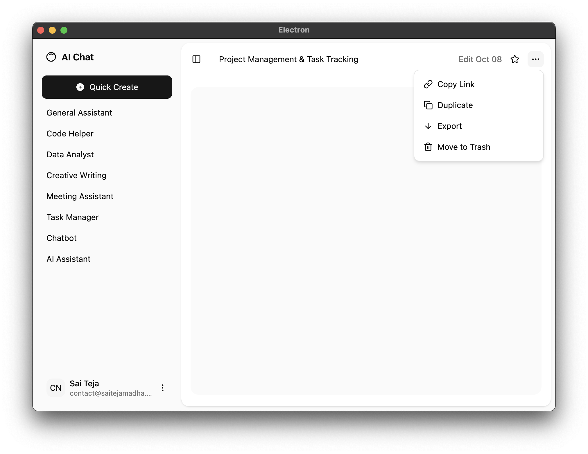

# Electron React Starter Template

An Electron application with React, TypeScript, and Tailwind CSS.



## Recommended IDE Setup

- [VSCode](https://code.visualstudio.com/) + [ESLint](https://marketplace.visualstudio.com/items?itemName=dbaeumer.vscode-eslint) + [Prettier](https://marketplace.visualstudio.com/items?itemName=esbenp.prettier-vscode) + [Tailwind CSS IntelliSense](https://marketplace.visualstudio.com/items?itemName=bradlc.vscode-tailwindcss)

## Project Setup

### Install

```bash
$ pnpm install
```

### Development

```bash
$ pnpm dev
```

### Build

```bash
# For windows
$ pnpm build:win

# For macOS
$ pnpm build:mac

# For Linux
$ pnpm build:linux
```
